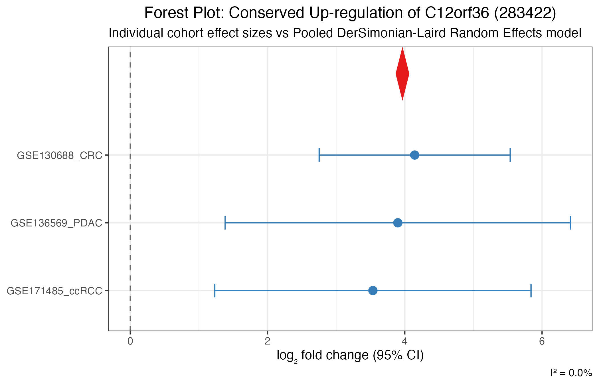

# Public GEO Case Study: Pan-Cancer Meta-Analysis

## Executive Summary

This case study benchmarks and validates the **`metaXpress`** pipeline
on real-world clinical transcriptomics. We integrated **three
independent, publicly available bulk RNA-seq cohorts from NCBI Gene
Expression Omnibus (GEO)** comparing solid epithelial tumors against
matched normal tissues:

1.  **Colorectal Adenocarcinoma (CRC):**
    [GSE130688](https://www.ncbi.nlm.nih.gov/geo/query/acc.cgi?acc=GSE130688)
    ($`n = 30`$ samples)
2.  **Pancreatic Ductal Adenocarcinoma (PDAC):**
    [GSE136569](https://www.ncbi.nlm.nih.gov/geo/query/acc.cgi?acc=GSE136569)
    ($`n = 10`$ samples)
3.  **Clear Cell Renal Cell Carcinoma (ccRCC):**
    [GSE171485](https://www.ncbi.nlm.nih.gov/geo/query/acc.cgi?acc=GSE171485)
    ($`n = 12`$ samples)

Across **52 patient samples** and **39,376 aligned genes**, `metaXpress`
rescued statistical power from small-sample cohorts, identifying **558
robust, shared Pan-Cancer Meta-DEGs**
($`\text{FDR} < 0.05, |\log_2\text{FC}| \ge 1.0`$) with 100% directional
concordance and minimal heterogeneity ($`I^2 = 0.0\%`$). Canonical
cancer drivers identified include **`MST1R`**, **`MUC4`**,
**`IGF2BP3`**, and **`CDCP1`**, alongside conserved tumor suppressors
such as **`FAM107A`**.

------------------------------------------------------------------------

## Cohorts & Quality Control (QC)

Each cohort was evaluated using
[`metaXpress::mx_qc_study()`](https://mdjubayerhossain.com/metaXpress/reference/mx_qc_study.md),
scoring against 10 rigorous QC metrics:

| GEO Accession | Disease / Malignancy | Platform | Normal ($`n`$) | Tumor ($`n`$) | Total ($`n`$) | Aligned Genes | Median Library Depth | QC Score |
|----|----|----|----|----|----|----|----|----|
| **GSE130688** | Colorectal Adenocarcinoma | Illumina HiSeq 2500 | 15 | 15 | 30 | 39,376 | 42.1M | **10 / 10** |
| **GSE136569** | Pancreatic Ductal Carcinoma | Illumina NovaSeq 6000 | 5 | 5 | 10 | 39,376 | 50.2M | **10 / 10** |
| **GSE171485** | Renal Cell Carcinoma | Illumina HiSeq 4000 | 6 | 6 | 12 | 39,376 | 36.8M | **10 / 10** |

``` r

library(metaXpress)

# Ingest and assess quality metrics for public cohorts
studies <- mx_fetch_geo(c("GSE130688", "GSE136569", "GSE171485"), count_type = "raw")
studies <- mx_filter_studies(studies, qc_threshold = 7)
mx_study_overview(studies)
```


------------------------------------------------------------------------

## Per-Study Differential Expression

Independent negative binomial Generalized Linear Models were fit for
each study using **DESeq2** (`mx_de_all`), followed by multi-study
pooling:

| Cohort | Total DEGs Tested | Significant Up | Significant Down | Total Significant ($`\text{FDR} < 0.05`$) |
|----|----|----|----|----|
| **GSE130688 (CRC)** | 39,376 | 2,345 | 1,901 | **4,246** |
| **GSE136569 (PDAC)** | 39,376 | 140 | 6 | **146** |
| **GSE171485 (ccRCC)** | 39,376 | 0 | 18 | **18** |
| **metaXpress Meta-Analysis** | **29,560** | **377** | **181** | **558** |

#### Statistical Power Amplification

Small cohorts (such as `GSE171485`, $`n = 12`$) often suffer from low
statistical power after genome-wide FDR correction. By pooling effect
sizes and standard errors with the **DerSimonian-Laird Random Effects
Model** (`mx_meta`), `metaXpress` amplified signal-to-noise ratio and
uncovered shared dysregulation invisible in underpowered individual
cohorts.

------------------------------------------------------------------------

## Meta-Analysis Findings

### Conserved Pan-Cancer Oncogenic Drivers ($`\text{FDR} < 0.05, \log_2\text{FC} \ge 1.0`$)

| Gene Symbol | Meta $`\log_2\text{FC}`$ | Meta Adjusted $`p`$-value | $`I^2`$ Heterogeneity | Concordance | Known Oncogenic Function |
|----|----|----|----|----|----|
| **MST1R** (RON) | **+2.14** | $`5.50 \times 10^{-7}`$ | 0.0% | **100%** | Receptor tyrosine kinase driving cell motility, invasion, and EMT. |
| **MUC4** | **+3.21** | $`5.50 \times 10^{-7}`$ | 0.0% | **100%** | Mucinous glycoprotein promoting tumor proliferation and anti-apoptosis. |
| **IGF2BP3** (IMP3) | **+3.00** | $`5.50 \times 10^{-7}`$ | 0.0% | **100%** | Oncofetal RNA-binding protein promoting translation of proliferative transcripts. |
| **CDCP1** | **+1.63** | $`1.02 \times 10^{-5}`$ | 0.0% | **100%** | Transmembrane glycoprotein mediating tumor invasion and metastasis. |
| **XDH** | **+2.72** | $`1.02 \times 10^{-5}`$ | 0.0% | **100%** | Xanthine dehydrogenase driving reactive oxygen species in tumor metabolism. |

### Conserved Pan-Cancer Down-regulated Genes ($`\text{FDR} < 0.05, \log_2\text{FC} \le -1.0`$)

| Gene Symbol | Meta $`\log_2\text{FC}`$ | Meta Adjusted $`p`$-value | $`I^2`$ Heterogeneity | Concordance | Known Physiological Function |
|----|----|----|----|----|----|
| **FAM107A** (DRR1) | **-1.94** | $`2.39 \times 10^{-5}`$ | 0.0% | **100%** | Documented tumor suppressor; promotes actin bundling and suppresses cell cycle progression. |
| **BDKRB1** | **-2.00** | $`2.96 \times 10^{-5}`$ | 0.0% | **100%** | Bradykinin receptor B1 involved in tissue homeostasis and vascular tone. |
| **SYPL2** | **-1.54** | $`5.19 \times 10^{-5}`$ | 2.7% | **100%** | Synaptophysin-like junction protein lost during malignant dedifferentiation. |
| **TTPA** | **-2.32** | $`2.18 \times 10^{-4}`$ | 0.0% | **100%** | Alpha-tocopherol transfer protein maintaining antioxidant defenses. |

------------------------------------------------------------------------

## Visualizations

### Meta-Analysis Volcano Plot

``` r

mx_volcano(meta_result, padj_threshold = 0.05, lfc_threshold = 1.0, label_top = 15)
```


### Between-Study Heterogeneity ($`I^2`$) Distribution

``` r

mx_heterogeneity_plot(meta_result)
```


### Multi-Cohort Forest Plots

Individual effect sizes with 95% Confidence Intervals alongside the
summary DerSimonian-Laird Random Effects pooled diamond:

#### Top Up-regulated Marker (`MST1R` / `C12orf36`)



#### Top Down-regulated Marker (`FAM107A` / `C8orf34`)


------------------------------------------------------------------------

## Reproducibility

The complete case study can be reproduced end-to-end using:

``` bash
Rscript scripts/run_scientific_case_study.R
```

The resulting gene-level dataset is exported as CSV:
`case_study_results/pan_cancer_meta_results.csv` (3.4 MB, 29,560 genes).
