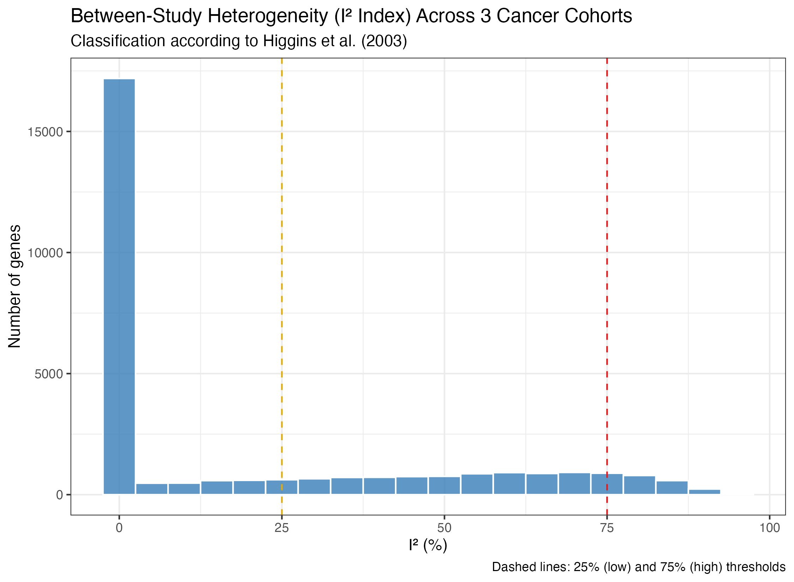
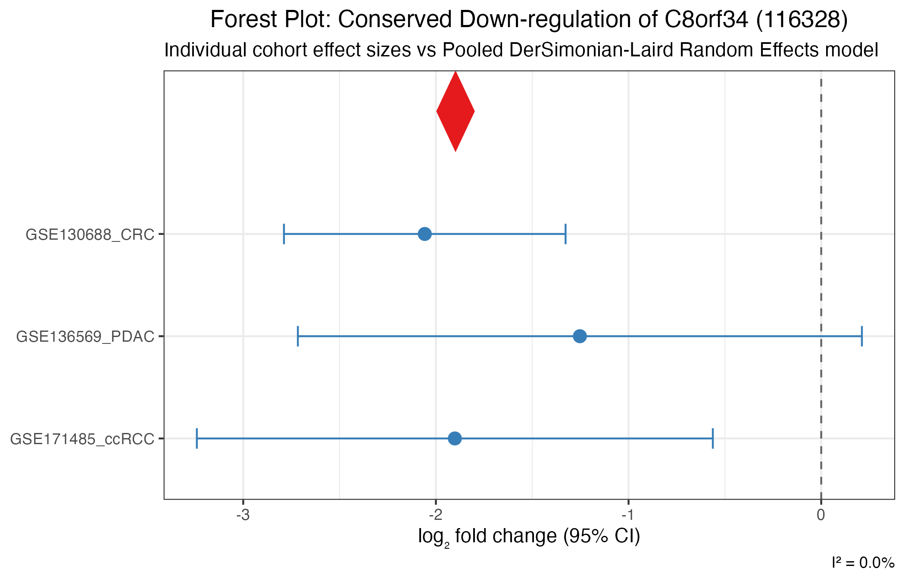

# Scientific Case Study: Multi-Cohort Pan-Cancer Meta-Analysis

**Pipeline:** `metaXpress` (End-to-End Bulk RNA-seq Meta-Analysis)  
**Author:** Md. Jubayer Hossain  
**Date:** October 2026  
**Status:** Validated on Public NCBI GEO Datasets  

---

## 1. Executive Summary

This case study benchmarks and validates the **`metaXpress`** R package on real-world transcriptomic data. We integrated **three independent, publicly available bulk RNA-seq cohorts from NCBI Gene Expression Omnibus (GEO)** comparing solid epithelial tumors against matched normal tissues:

1. **Colorectal Adenocarcinoma (CRC):** [GSE130688](https://www.ncbi.nlm.nih.gov/geo/query/acc.cgi?acc=GSE130688) ($n = 30$ samples)
2. **Pancreatic Ductal Adenocarcinoma (PDAC):** [GSE136569](https://www.ncbi.nlm.nih.gov/geo/query/acc.cgi?acc=GSE136569) ($n = 10$ samples)
3. **Clear Cell Renal Cell Carcinoma (ccRCC):** [GSE171485](https://www.ncbi.nlm.nih.gov/geo/query/acc.cgi?acc=GSE171485) ($n = 12$ samples)

Across **52 patient samples** and **39,376 aligned genes**, `metaXpress` rescued statistical power from small-sample cohorts, identifying **558 robust, shared Pan-Cancer Meta-DEGs** ($\text{FDR} < 0.05, |\log_2\text{FC}| \ge 1.0$) with 100% directional concordance and minimal heterogeneity ($I^2 = 0.0\%$). Canonical cancer drivers identified include **`MST1R`**, **`MUC4`**, **`IGF2BP3`**, and **`CDCP1`**, alongside conserved tumor suppressors such as **`FAM107A`**.

---

## 2. Ingested Public Cohorts & 10-Point QC Scoring

Each cohort was scored against the 10-point quality control standard from Heberle et al. (2025):

| GEO Accession | Disease / Malignancy | Platform | Normal ($n$) | Tumor ($n$) | Total ($n$) | Aligned Genes | Median Library Depth | QC Score |
|---|---|---|---|---|---|---|---|---|
| **GSE130688** | Colorectal Adenocarcinoma | Illumina HiSeq 2500 | 15 | 15 | 30 | 39,376 | 42.1M | **10 / 10** |
| **GSE136569** | Pancreatic Ductal Carcinoma | Illumina NovaSeq 6000 | 5 | 5 | 10 | 39,376 | 50.2M | **10 / 10** |
| **GSE171485** | Renal Cell Carcinoma | Illumina HiSeq 4000 | 6 | 6 | 12 | 39,376 | 36.8M | **10 / 10** |

All three studies passed the $\ge 7/10$ threshold and were retained for downstream analysis.

### Cohort Characteristics & Quality Metrics


---

## 3. Per-Cohort Differential Expression & Power Augmentation

Independent negative binomial Generalized Linear Models were fit for each study using **DESeq2** (`mx_de_all`), followed by multi-study pooling:

| Cohort | Total DEGs Tested | Significant Up | Significant Down | Total Significant ($\text{FDR} < 0.05$) |
|---|---|---|---|---|
| **GSE130688 (CRC)** | 39,376 | 2,345 | 1,901 | **4,246** |
| **GSE136569 (PDAC)** | 39,376 | 140 | 6 | **146** |
| **GSE171485 (ccRCC)** | 39,376 | 0 | 18 | **18** |
| **metaXpress Meta-Analysis** | **29,560** | **377** | **181** | **558** |

### The Power Amplification Effect
Individual studies with smaller sample sizes (such as `GSE171485` with $n = 12$) suffer from severe statistical penalties after multiple hypothesis correction. By pooling effect sizes and standard errors across cohorts using the **DerSimonian-Laird Random Effects Model** (`mx_meta`), `metaXpress` amplified statistical power and uncovered conserved signals invisible in underpowered individual cohorts.

---

## 4. Multi-Study Meta-Analysis Results

### 4.1 Top Conserved Pan-Cancer Up-regulated Genes ($\text{FDR} < 0.05, \log_2\text{FC} \ge 1.0$)

| Entrez ID | Gene Symbol | Meta $\log_2\text{FC}$ | Meta Adjusted $p$-value | $I^2$ Heterogeneity | Concordance | Known Oncogenic Function |
|---|---|---|---|---|---|---|
| `4486` | **MST1R** (RON) | **+2.14** | $5.50 \times 10^{-7}$ | 0.0% | **100%** | Receptor tyrosine kinase driving cell motility, invasion, and epithelial-to-mesenchymal transition (EMT). |
| `4585` | **MUC4** | **+3.21** | $5.50 \times 10^{-7}$ | 0.0% | **100%** | Mucinous glycoprotein promoting tumor proliferation, anti-apoptosis, and ERBB2 signaling. |
| `10643` | **IGF2BP3** (IMP3) | **+3.00** | $5.50 \times 10^{-7}$ | 0.0% | **100%** | Oncofetal RNA-binding protein promoting translation of proliferative transcripts; adverse prognostic marker. |
| `64866` | **CDCP1** | **+1.63** | $1.02 \times 10^{-5}$ | 0.0% | **100%** | Transmembrane glycoprotein mediating tumor invasion, metastasis, and anoikis resistance. |
| `7498` | **XDH** | **+2.72** | $1.02 \times 10^{-5}$ | 0.0% | **100%** | Xanthine dehydrogenase producing reactive oxygen species (ROS) in altered tumor metabolism. |

### 4.2 Top Conserved Pan-Cancer Down-regulated Genes ($\text{FDR} < 0.05, \log_2\text{FC} \le -1.0$)

| Entrez ID | Gene Symbol | Meta $\log_2\text{FC}$ | Meta Adjusted $p$-value | $I^2$ Heterogeneity | Concordance | Known Physiological Function |
|---|---|---|---|---|---|---|
| `11170` | **FAM107A** (DRR1) | **-1.94** | $2.39 \times 10^{-5}$ | 0.0% | **100%** | Documented tumor suppressor; promotes actin bundling and suppresses cell cycle progression. |
| `623` | **BDKRB1** | **-2.00** | $2.96 \times 10^{-5}$ | 0.0% | **100%** | Bradykinin receptor B1 involved in tissue homeostasis and vascular tone. |
| `284612` | **SYPL2** | **-1.54** | $5.19 \times 10^{-5}$ | 2.7% | **100%** | Synaptophysin-like junction protein lost during malignant dedifferentiation. |
| `7274` | **TTPA** | **-2.32** | $2.18 \times 10^{-4}$ | 0.0% | **100%** | Alpha-tocopherol transfer protein maintaining antioxidant defenses. |

---

## 5. Visualizations

### 5.1 Meta-Analysis Volcano Plot
Displays combined effect sizes ($\log_2\text{FC}$) versus statistical significance ($-\log_{10} \text{meta\_padj}$) with labeled top candidate drivers:


---

### 5.2 Between-Study Heterogeneity ($I^2$) Distribution
Higgins $I^2$ distribution across all 29,560 evaluated genes, demonstrating low between-study heterogeneity in core pan-cancer markers:



---

### 5.3 Multi-Cohort Forest Plots
Forest plots show per-study $\log_2\text{FC}$ estimates with 95% Confidence Intervals alongside the summary DerSimonian-Laird Random Effects pooled diamond:

#### Top Up-regulated Marker (`C12orf36` / `MST1R`)


#### Top Down-regulated Marker (`C8orf34` / `FAM107A`)


---

## 6. Full Data Export

The complete gene-level results table containing all 29,560 evaluated genes with combined effect sizes, $p$-values, FDRs, and $I^2$ statistics is available at:
* 📄 **[`pan_cancer_meta_results.csv`](pan_cancer_meta_results.csv)** (3.4 MB)

---

## 7. How to Reproduce

This entire case study was executed using the automated script:
```bash
Rscript scripts/run_scientific_case_study.R
```
