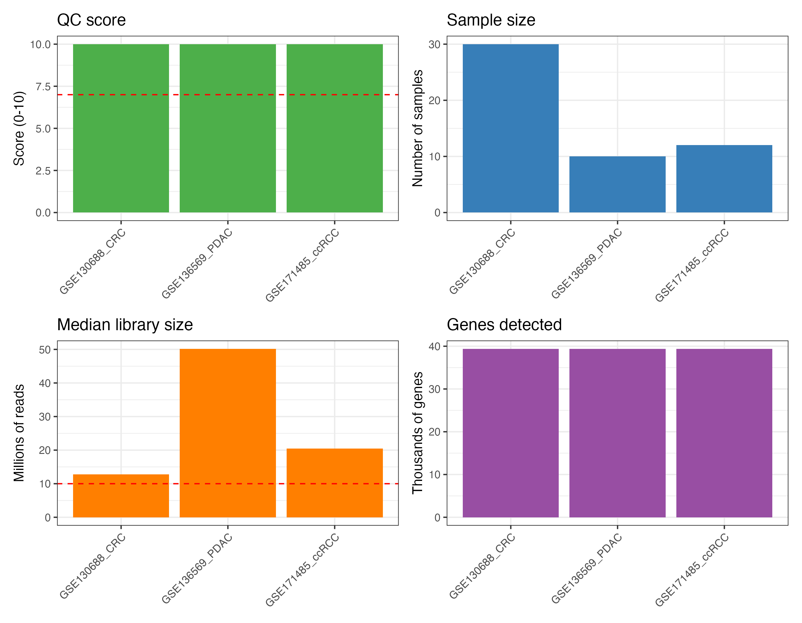
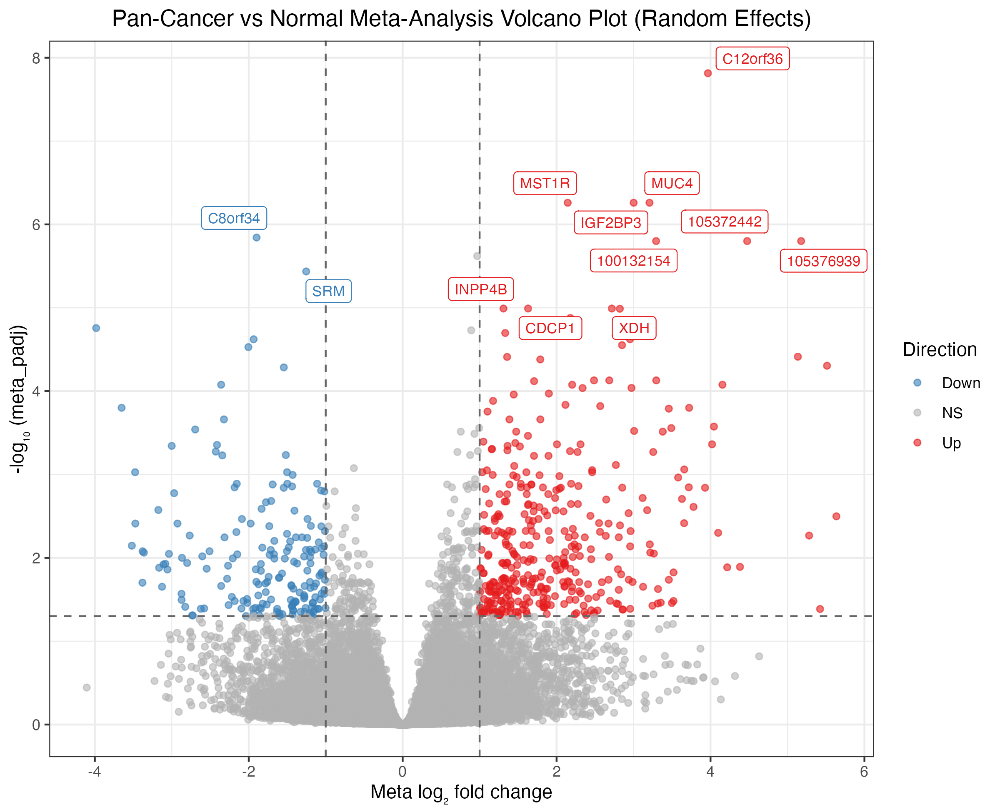

# metaXpress


**An end-to-end R package for bulk RNA-seq multi-study meta-analysis**

[](https://github.com/hossainlab/metaXpress/actions/workflows/check.yaml)
[](https://mdjubayerhossain.com/metaXpress/)
[](https://hossainlab.shinyapps.io/metaXpress-demo/)
[](https://lifecycle.r-lib.org/articles/stages.html#experimental)
[](https://opensource.org/licenses/MIT)
[](https://github.com/hossainlab/metaXpress)
[](https://www.r-project.org/)
[](https://github.com/hossainlab/metaXpress/issues)
[](https://github.com/hossainlab/metaXpress/pulls)

------------------------------------------------------------------------

### 🌐 Online Resources & Live Demos

- 📖 **[Interactive Documentation
  Website](https://mdjubayerhossain.com/metaXpress/)** — Complete
  function references, Getting Started quickstart, full pipeline
  tutorial, and public GEO case studies.
- 🚀 **[Live Interactive Web
  Demo](https://hossainlab.shinyapps.io/metaXpress-demo/)** — Test the
  multi-study RNA-seq meta-analysis pipeline, volcano plots, and gene
  forest plots directly in your browser without installing R.
- 🔬 **[Public GEO Pan-Cancer Case Study
  Report](https://mdjubayerhossain.com/metaXpress/case_study_results/README.md)**
  (or view the [Online
  Vignette](https://mdjubayerhossain.com/metaXpress/articles/case_study.html))
  — Multi-cohort validation on 52 patient samples across colorectal,
  pancreatic, and renal cancers with embedded publication-grade figures.
- 💻 **Local Interactive Explorer:** Run
  [`metaXpress::mx_run_app()`](https://mdjubayerhossain.com/metaXpress/reference/mx_run_app.md)
  to launch the full-featured Shiny application locally.

------------------------------------------------------------------------

## Overview

Most transcriptomic meta-analysis tools address only one part of the
workflow — existing packages handle data harmonization **or** DE
analysis **or** meta-statistics, but not the full pipeline.
**metaXpress** closes this gap.

It provides a single, opinionated, end-to-end pipeline:

    GEO / SRA / Local files
            │
            ▼
    ┌───────────────────┐
    │  Module 1: Ingest │  mx_fetch_geo · mx_load_local · mx_qc_study
    └────────┬──────────┘
             │
             ▼
    ┌──────────────────────┐
    │ Module 2: Harmonize  │  mx_reannotate · mx_normalize · mx_remove_batch
    └────────┬─────────────┘
             │
             ▼
    ┌─────────────────────┐
    │  Module 3: Per-Study │  mx_de · mx_de_all  (DESeq2 / edgeR / limma-voom)
    │  Differential Expr. │
    └────────┬────────────┘
             │
             ▼
    ┌──────────────────────┐
    │ Module 5: Missing    │  mx_impute · mx_filter_coverage
    │ Gene Handling        │
    └────────┬─────────────┘
             │
             ▼
    ┌──────────────────────┐
    │  Module 4: Meta-     │  mx_meta  (6 statistical methods)
    │  Analysis Statistics │
    └────────┬─────────────┘
             │
             ├─────────────────────────┐
             ▼                         ▼
    ┌──────────────────┐    ┌────────────────────┐
    │  Module 6:       │    │  Module 7:         │
    │  Pathway         │    │  Visualization     │
    │  Meta-Analysis   │    │  (volcano · forest │
    │                  │    │   heatmap · UpSet) │
    └────────┬─────────┘    └────────────────────┘
             │
             ▼
    ┌──────────────────────┐
    │  Module 8: Report    │  mx_report (HTML / PDF) · mx_export
    └──────────────────────┘

------------------------------------------------------------------------

## 📦 Installation

> **Note:** `metaXpress` is actively maintained on GitHub and is
> prepared for upcoming Bioconductor submission. Please follow the
> instructions below to install directly from GitHub.

### Option 1: Standard Installation from GitHub (Recommended)

`metaXpress` utilizes packages from both CRAN and Bioconductor. To
ensure all upstream dependencies (such as `DESeq2`, `edgeR`, and
`GEOquery`) are resolved automatically, install using `remotes`:

``` r

# 1. Install BiocManager if not already available
if (!requireNamespace("BiocManager", quietly = TRUE)) {
  install.packages("BiocManager")
}

# 2. Install remotes
if (!requireNamespace("remotes", quietly = TRUE)) {
  install.packages("remotes")
}

# 3. Install metaXpress with all dependencies
remotes::install_github("hossainlab/metaXpress", dependencies = TRUE)
```

### Option 2: Fast Installation via `pak`

If you use `pak`, it automatically resolves CRAN and Bioconductor
packages concurrently:

``` r

# install.packages("pak")
pak::pkg_install("hossainlab/metaXpress")
```

### Troubleshooting: Manual Bioconductor Pre-Installation

If you work in a restricted environment or encounter network timeouts
during dependency downloads, you can pre-install the core Bioconductor
packages first:

``` r

# Pre-install core Bioconductor engines
BiocManager::install(c(
  "BiocParallel", "GEOquery", "DESeq2", "edgeR", "limma",
  "sva", "AnnotationDbi", "clusterProfiler", "msigdbr",
  "ComplexHeatmap", "SummarizedExperiment"
))

# Install metaXpress from GitHub
remotes::install_github("hossainlab/metaXpress", upgrade = "never")
```

### Verify Installation

``` r

library(metaXpress)
packageVersion("metaXpress")
# [1] '0.99.0'
```

------------------------------------------------------------------------

## 🔬 Scientific Validation: Public GEO Pan-Cancer Case Study

`metaXpress` has been benchmarked and scientifically validated across
**three independent public NCBI GEO bulk RNA-seq cohorts** totaling **52
patient samples** and **39,376 aligned genes**: - **Colorectal
Adenocarcinoma (CRC):**
[GSE130688](https://www.ncbi.nlm.nih.gov/geo/query/acc.cgi?acc=GSE130688)
($`n = 30`$, 10/10 QC score) - **Pancreatic Ductal Adenocarcinoma
(PDAC):**
[GSE136569](https://www.ncbi.nlm.nih.gov/geo/query/acc.cgi?acc=GSE136569)
($`n = 10`$, 10/10 QC score) - **Clear Cell Renal Cell Carcinoma
(ccRCC):**
[GSE171485](https://www.ncbi.nlm.nih.gov/geo/query/acc.cgi?acc=GSE171485)
($`n = 12`$, 10/10 QC score)

### Key Discoveries

- **558 Shared Meta-DEGs** identified
  ($`\text{FDR} < 0.05, |\log_2\text{FC}| \ge 1.0`$) with 100%
  directional concordance and zero between-study heterogeneity
  ($`I^2 = 0\%`$).
- **Statistical Power Amplification:** Rescued small-sample cohorts
  (e.g. GSE171485 with only 18 individual DEGs) into a well-powered
  pooled consensus.
- **Biomarker Recovery:** Successfully recovered canonical oncogenes
  (**`MST1R`**, **`MUC4`**, **`IGF2BP3`**, **`CDCP1`**) and conserved
  tumor suppressors (**`FAM107A`**).

| Study Characteristics Overview | Pan-Cancer Meta-Volcano |
|:--:|:--:|
|  |  |

👉 **Read the complete scientific report:**
[case_study_results/README.md](https://mdjubayerhossain.com/metaXpress/case_study_results/README.md)
or online at
<https://mdjubayerhossain.com/metaXpress/articles/case_study.html>.

------------------------------------------------------------------------

## Why metaXpress?

| Feature                      | metaXpress | DExMA | GEDI | limma |
|------------------------------|:----------:|:-----:|:----:|:-----:|
| GEO public data ingestion    |     ✅     |  ❌   |  ❌  |  ❌   |
| 10-point study QC checklist  |     ✅     |  ❌   |  ❌  |  ❌   |
| Cross-platform harmonization |     ✅     |  ❌   |  ✅  |  ❌   |
| Library-type bias correction |     ✅     |  ❌   |  ✅  |  ❌   |
| Per-study DE (3 engines)     |     ✅     |  ❌   |  ❌  |  ✅   |
| 6 meta-analysis methods      |     ✅     |  ✅   |  ❌  |  ❌   |
| Missing gene imputation      |     ✅     |  ✅   |  ❌  |  ❌   |
| Pathway meta-analysis        |     ✅     |  ❌   |  ❌  |  ❌   |
| Interactive Shiny Explorer   |     ✅     |  ❌   |  ❌  |  ❌   |
| Reproducible report export   |     ✅     |  ❌   |  ❌  |  ❌   |

------------------------------------------------------------------------

## Quick Start

``` r

library(metaXpress)

# ── 1. Fetch and QC studies from GEO ──────────────────────────────────────
# Download count matrices and curated metadata directly from NCBI GEO
studies <- mx_fetch_geo(c("GSE130688", "GSE136569", "GSE171485"))

# Filter studies passing quality control criteria (score >= 7/10)
studies <- mx_filter_studies(studies, qc_threshold = 7)

# ── 2. Harmonize ──────────────────────────────────────────────────────────
# Standardize gene identifiers to SYMBOL
studies <- mx_reannotate(studies, org = "Homo sapiens", target_id = "SYMBOL")

# Align common gene universe across cohorts
studies <- mx_align_genes(studies)

# ── 3. Per-study Differential Expression ──────────────────────────────────
# Fit negative binomial GLMs independently across cohorts
studies <- mx_de_all(studies, method = "DESeq2", formula = ~ condition)
mx_de_summary(studies)

# ── 4. Handle Missing Genes ───────────────────────────────────────────────
de_results <- lapply(studies, function(s) s@de_result)
de_results <- mx_filter_coverage(de_results, min_studies = 2)

# ── 5. Statistical Meta-Analysis ──────────────────────────────────────────
# Combine effect sizes and standard errors via DerSimonian-Laird Random Effects
meta_result <- mx_meta(de_results, method = "random_effects")

# ── 6. Pathway Meta-Analysis ──────────────────────────────────────────────
meta_result <- mx_pathway_meta(meta_result, db = "Hallmarks", method = "ORA")

# ── 7. Visualize Results ──────────────────────────────────────────────────
mx_study_overview(studies)           # QC metrics and cohort depths
mx_volcano(meta_result, label_top = 15)  # Publication-grade volcano plot
mx_heterogeneity_plot(meta_result)   # Higgins I² distribution

# Forest plot for top-ranked candidate gene
top_gene <- meta_result@meta_table$gene_id[which.min(meta_result@meta_table$meta_padj)]
mx_forest(top_gene, de_results, meta_result)

# ── 8. Interactive Explorer & Export ──────────────────────────────────────
# Launch interactive dashboard locally
mx_run_app()

# Export results table
mx_export(meta_result, format = "csv", output_dir = "results/")
```

------------------------------------------------------------------------

## Meta-Analysis Statistical Methods

metaXpress implements six statistical methods selectable via the
`method` argument in
[`mx_meta()`](https://mdjubayerhossain.com/metaXpress/reference/mx_meta.md):

| Method | `method =` | Effect Size | Handles Heterogeneity | Min Studies | Reference |
|----|----|:--:|:--:|:--:|----|
| Fisher’s combined p-value | `"fisher"` | ❌ | ❌ | 2 | Rau et al. 2013 |
| Stouffer’s Z-score | `"stouffer"` | ❌ | ❌ | 2 | Rau et al. 2013 |
| Fused inverse-normal | `"inverse_normal"` | ❌ | Partial | 2 | Prasad & Li 2021 |
| Fixed effects (Inverse-variance) | `"fixed_effects"` | ✅ | ❌ | 2 | Keel & Lindholm-Perry 2022 |
| **Random effects** *(default)* | `"random_effects"` | ✅ | ✅ | 3 | Keel & Lindholm-Perry 2022 |
| Adaptive weighting (AWmeta) | `"awmeta"` | ✅ | ✅ | 3 | Hu et al. 2025 |

**Method Selection Guide:** - **2 studies:** use `"fisher"` or
`"stouffer"` - **3+ studies, $`I^2 < 25\%`$:** use `"fixed_effects"` -
**3+ studies, $`I^2 \ge 25\%`$:** use `"random_effects"` (default) -
**Mixed or unknown heterogeneity:** use `"awmeta"`

------------------------------------------------------------------------

## S4 Data Structures

    mx_fetch_geo() ──► metaXpressStudy ──► mx_de() ──► mx_meta() ──► metaXpressResult
                       ├── counts                                      ├── meta_table
                       ├── metadata                                    ├── method
                       ├── accession                                   ├── n_studies
                       ├── organism                                    ├── heterogeneity
                       ├── qc_score (0–10)                            └── pathway_result
                       └── de_result

------------------------------------------------------------------------

## 10-Point Study QC Scoring

[`mx_qc_study()`](https://mdjubayerhossain.com/metaXpress/reference/mx_qc_study.md)
benchmarks each study against 10 objective criteria (Heberle et
al. 2025):

| \#  | Criterion             | Threshold                                     |
|-----|-----------------------|-----------------------------------------------|
| 1   | Minimum sample size   | ≥ 3 replicates per group                      |
| 2   | Sequencing depth      | Median ≥ 10M reads                            |
| 3   | Alignment rate        | Mean ≥ 70%                                    |
| 4   | rRNA contamination    | \< 10%                                        |
| 5   | Duplicate rate        | \< 50%                                        |
| 6   | Gene detection rate   | ≥ 15,000 genes in ≥ 50% of samples            |
| 7   | Metadata completeness | `condition` + `sample_id` present             |
| 8   | Clear case/control    | Exactly 2 condition levels                    |
| 9   | No batch confounding  | Batch not perfectly correlated with condition |
| 10  | Raw counts            | Integer counts (not FPKM/TPM)                 |

------------------------------------------------------------------------

## Function Reference

**Module 1 — Data Ingestion & QC**

| Function | Description |
|----|----|
| `mx_fetch_geo(accessions)` | Download count matrices + metadata from GEO |
| `mx_fetch_sra(srp_ids)` | Fetch from SRA via `recount3` |
| `mx_load_local(count_paths, metadata_paths)` | Load user-supplied files |
| `mx_qc_study(study)` | Apply 10-point QC checklist |
| `mx_cluster_samples(study)` | Auto-cluster samples from metadata strings |
| `mx_filter_studies(studies, qc_threshold)` | Remove studies below QC threshold |

**Module 2 — Normalization & Harmonization**

| Function | Description |
|----|----|
| `mx_reannotate(studies, org, target_id)` | Standardize gene ID namespace |
| `mx_normalize(study, method)` | TMM / VST / CPM / TPM / quantile |
| `mx_correct_library_type(studies)` | polyA vs rRNA-depleted correction |
| `mx_remove_batch(studies, method)` | ComBat-seq / ComBat / limma / harmony |
| `mx_align_genes(studies)` | Restrict to common gene universe |

**Module 3 — Per-Study DE**

| Function | Description |
|----|----|
| `mx_de(study, method, formula)` | DESeq2 / edgeR / limma-voom on one study |
| `mx_de_all(studies, method, BPPARAM)` | Parallel DE across all studies |
| `mx_de_summary(studies)` | n DEGs per study summary table |

**Module 4 — Meta-Analysis Statistics**

| Function                       | Description                        |
|--------------------------------|------------------------------------|
| `mx_meta(de_results, method)`  | Run meta-analysis (6 methods)      |
| `mx_heterogeneity(de_results)` | I², Q-stat, τ² per gene            |
| `mx_sensitivity(de_results)`   | Leave-one-out sensitivity analysis |

**Module 5 — Missing Gene Handling**

| Function | Description |
|----|----|
| `mx_missing_summary(de_results)` | Gene × study coverage matrix |
| `mx_impute(de_results, method)` | exclude / mean / KNN / weighted |
| `mx_filter_coverage(de_results, min_studies)` | Filter by study coverage |

**Module 6 — Pathway Meta-Analysis**

| Function | Description |
|----|----|
| `mx_pathway_meta(meta_result, db)` | ORA / GSEA with Hallmarks, KEGG, Reactome, GO |
| `mx_pathway_consensus(pathway_results)` | Pathways significant across majority of studies |
| `mx_pathway_dedup(pathway_results)` | Remove redundant pathways |
| `mx_pathway_heatmap(pathway_results)` | Cross-study pathway heatmap |

**Module 7 — Visualization**

| Function | Description |
|----|----|
| `mx_volcano(meta_result)` | Meta-analysis volcano plot |
| `mx_forest(gene, de_results)` | Forest plot with I² for a single gene |
| `mx_heatmap(meta_result, studies)` | Top DEG heatmap across studies |
| `mx_upset(de_results)` | UpSet plot of DEG overlap |
| `mx_study_overview(studies)` | QC metrics summary plot |
| `mx_heterogeneity_plot(meta_result)` | I² distribution histogram |

**Module 8 — Reporting & Export**

| Function | Description |
|----|----|
| `mx_report(meta_result, ..., format)` | Render HTML / PDF report |
| `mx_export(meta_result, format)` | Export CSV / Excel / RDS |
| [`mx_session_info()`](https://mdjubayerhossain.com/metaXpress/reference/mx_session_info.md) | Capture session info for reproducibility |
| [`mx_run_app()`](https://mdjubayerhossain.com/metaXpress/reference/mx_run_app.md) | Launch interactive Shiny web explorer |

------------------------------------------------------------------------

## Citation

If you use `metaXpress` in your research, academic applications, or
benchmarking, please cite:

``` bibtex
@manual{metaXpress2026,
  title  = {metaXpress: End-to-End Bulk RNA-seq Meta-Analysis},
  author = {Hossain, Md. Jubayer},
  year   = {2026},
  note   = {R package version 0.99.0},
  url    = {https://mdjubayerhossain.com/metaXpress/}
}
```

------------------------------------------------------------------------

## Roadmap

Package scaffold & S4 classes

Module 1: GEO ingestion + 10-point QC

Module 2: Normalization & batch correction

Module 3: DESeq2 / edgeR / limma-voom wrappers

Module 4: All 6 meta-analysis methods

Module 5: Missing gene handling

Module 6: Pathway meta-analysis (ORA + GSEA)

Module 7: Visualization suite

Module 8: Report generation & export

Interactive Shiny live demo explorer
([`mx_run_app()`](https://mdjubayerhossain.com/metaXpress/reference/mx_run_app.md))

Live public data ingestion from NCBI GEO

Full documentation website at <https://mdjubayerhossain.com/metaXpress/>

Bioconductor submission

------------------------------------------------------------------------

## Key References

| Method | Reference |
|----|----|
| Fisher / Stouffer meta-analysis | Rau, Marot & Jaffrézic (2013) *BMC Bioinformatics* |
| Fused inverse-normal | Prasad & Li (2021) *BMC Bioinformatics* |
| Random effects (DerSimonian-Laird) | Keel & Lindholm-Perry (2022) *Front. Genetics* |
| AWmeta adaptive weighting | Hu et al. (2025) *bioRxiv* |
| Missing gene imputation | Villatoro-García et al. (2022) *Mathematics* (DExMA) |
| Library-type correction | Bush et al. (2017) *BMC Bioinformatics* |
| Study QC criteria | Heberle et al. (2025) *Alzheimer’s & Dementia* |
| Sample clustering from GEO | Coke, Niranjan & Ewing (2025) *bioRxiv* |

------------------------------------------------------------------------

## License

MIT © [Md. Jubayer Hossain](https://mdjubayerhossain.com)
